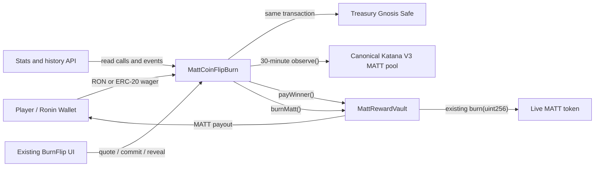

# BurnFlip Architecture

## Purpose

Universal BurnFlip is an in-place replacement of the existing Burn Flip game. It preserves the heads/tails interface and future-block commit/reveal sequence, but separates three kinds of value:

- **Wager asset:** RON, MATT, or another enabled ecosystem ERC-20 supplied by the player.
- **Treasury asset:** the same wager asset, transferred immediately and permanently to the Gnosis Safe.
- **Settlement asset:** MATT, paid or burned only by the dedicated Reward Vault.

The live MATT token is an immutable external dependency and is not changed.

## Components

## Contract responsibilities

### `MattCoinFlipBurn`

- Holds immutable MATT, wrapped RON, Katana V3 factory, and treasury addresses.
- Maintains the supported-asset-to-pool mapping and minimum harmonic-liquidity floor.
- Calls `observe([1800, 0])`; there is no spot-price or manual-price fallback.
- Prices MATT wagers by exact token identity (`1 MATT = 1 MATT`) without an unnecessary or manipulable oracle round trip.
- Stores the MATT equivalent, payout, burn, mean tick, and commitment at placement.
- Transfers ERC-20 wagers directly from the player to the Safe and verifies the exact Safe balance increase.
- Forwards native RON to the Safe before placement returns.
- Reserves the maximum MATT payout against the vault balance.
- Settles a winner through `payWinner()` or a loss through `burnMatt()`.
- Treats an expired unrevealed bet as a loss, preventing result withholding from becoming a free option.

### `MattRewardVault`

- Accepts MATT deposits and owner refills.
- Allows only its configured BurnFlip address to pay or burn.
- Calls the live MATT token's existing `burn(uint256)` function.
- Starts paused and can only change its BurnFlip address while paused.
- Cannot rescue or arbitrarily transfer MATT.

### `KatanaTwap`

- Computes the floor-rounded arithmetic mean tick and harmonic mean liquidity.
- Converts the wager amount into MATT using the V3 tick ratio with full-precision multiplication/division.
- Rejects invalid history, zero liquidity, and out-of-range ticks.

## Asset identity

The address list originally supplied in the product brief was shifted by one symbol. Contract calls on Ronin confirm that `0xe514…` is wrapped RON and `0x0B700…` is USDC. The canonical configuration uses on-chain `symbol()` and `decimals()` results:

| UI asset | Contract/oracle token | Decimals |
|---|---|---:|
| RON | WRON `0xe514d9DEB7966c8BE0ca922de8a064264eA6bcd4` | 18 |
| MATT | identity-priced `0xa5450417BDCa0BDfB058ffE41205400FfDA1174d` | 18 |
| USDC | `0x0B7007c13325C48911F73A2daD5FA5dCBf808aDc` | 6 |
| WATER | `0x57A8Eb80d6813AEEEB9c8e770011C016F980d581` | 18 |
| FIRE | `0x0E8Edc6f5CaC5dCaE036Ad77Fc0dE4E72404e2Fb` | 18 |
| EARTH | `0xC89384CD2970c916DC75DA8e11524eBE6d77fa07` | 18 |
| COIN | `0x7dc167e270d5EF683ceaf4aFCDf2efbDd667a9A7` | 18 |
| RONKE | `0xf988f63bf26C3Ed3fBf39922149E3E7b1e5c27cB` | 18 |
| NOTUS | `0x214b8ba88244587b69c609214e0b3e6cf56025d1` | 18 |

## Bet lifecycle

1. The browser creates a random 32-byte secret.
2. It commits to the secret, wallet, asset, choice, amount, game address, and chain ID.
3. The contract obtains an exact 1:1 MATT identity quote or a safe TWAP quote for another asset, reserves the winner liability, stores the bet, and sends the wager to the Safe atomically.
4. After the entropy block, the browser reveals the secret.
5. The outcome hashes the secret with the future block hash, bet ID, contract, and chain.
6. The vault pays the stored payout or burns the stored burn amount.
7. If the reveal window closes, anyone may finalize the configured loss burn.

The commitment domain and one-active-bet rule prevent cross-player, cross-contract, cross-chain, amount, asset, and choice replay.

## Frontend and API

The hub still loads BurnFlip through the existing `/burnflip` route. `burnflip-shell.js` reshapes the current game card, while the strict TypeScript source in `website/src/burnflip-controller.ts` owns reads, approvals, confirmation, secret storage, reveal, and result rendering.

The website does not ship a replacement address until deployment. `burnflip-stats-cache.js` reads counters directly from the configured game, and `burnflip-history-index.js` reconstructs player records from `GamePlayed` events. Both return `CONFIG_PENDING` until address and deployment block are configured.

## Events

The implementation emits `GamePlayed`, `WinnerPaid`, `MattBurned`, `TreasuryDeposit`, and `PoolPriceUsed`, plus lifecycle and administration events. `GamePlayed` includes both possible settlement amounts so indexers do not need mutable configuration to reconstruct historical economics.
